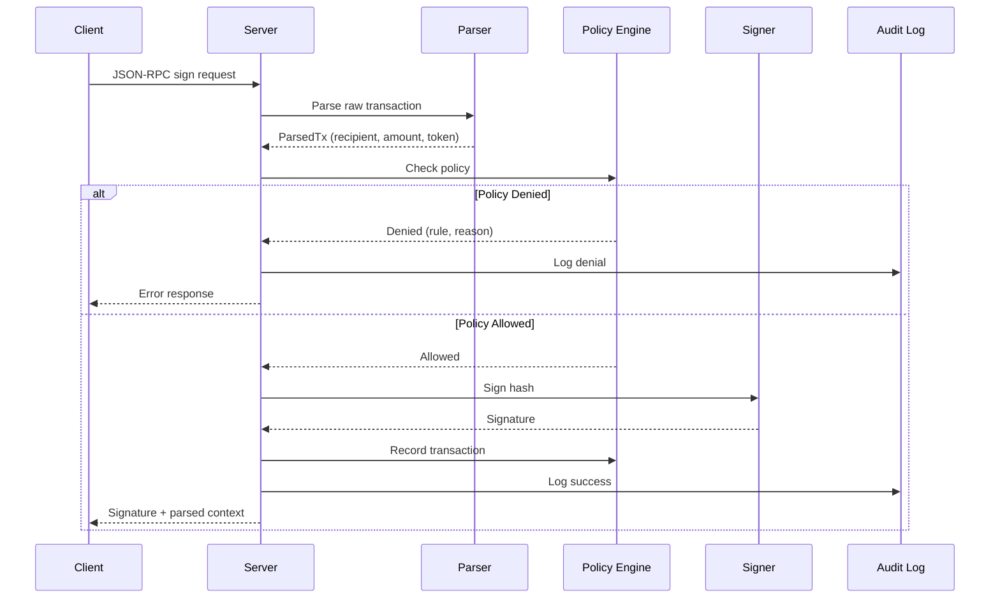
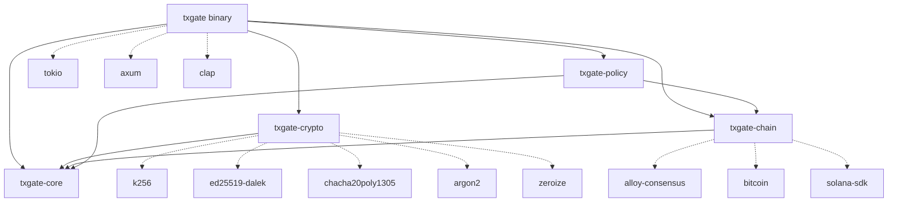
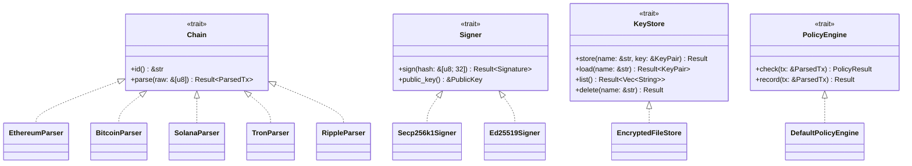
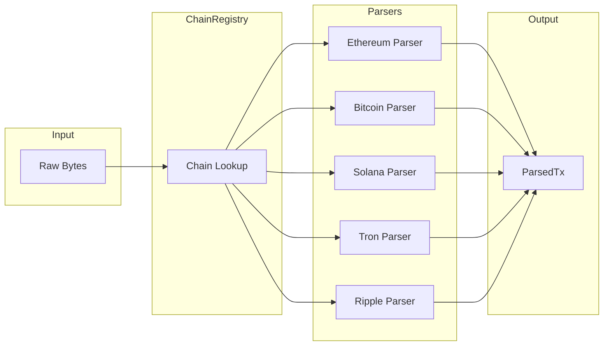
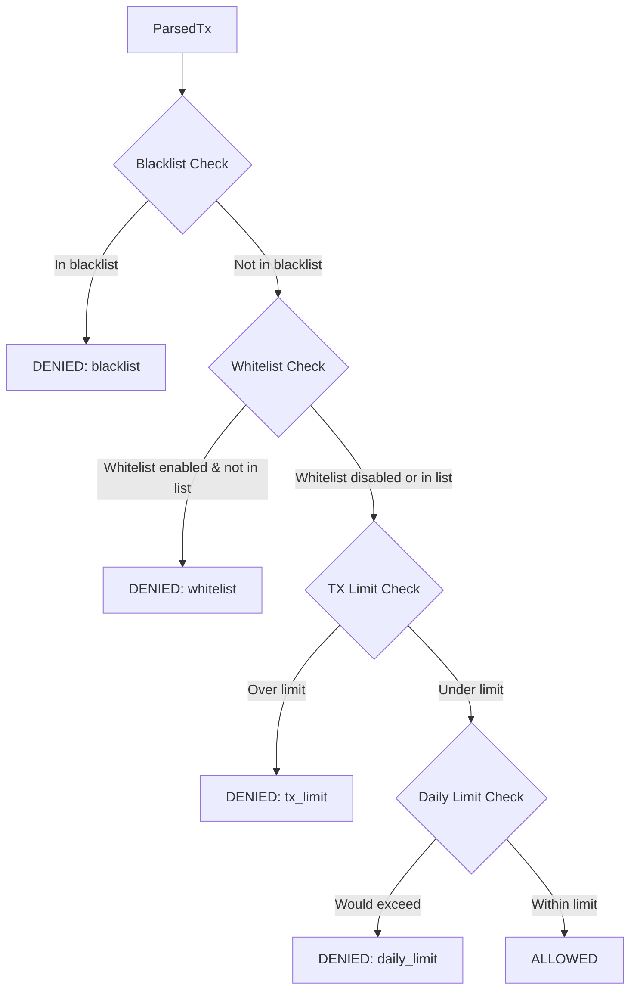

# TxGate Architecture

**Version:** 0.1.0
**Last Updated:** 2026-01-21
**Status:** Design Phase

---

## Table of Contents

1. [Executive Summary](#executive-summary)
2. [System Overview](#system-overview)
3. [Crate Structure](#crate-structure)
4. [Core Abstractions](#core-abstractions)
5. [Data Flow](#data-flow)
6. [Security Model](#security-model)
7. [Chain Support](#chain-support)
8. [Policy Engine](#policy-engine)
9. [Server Architecture](#server-architecture)
10. [Configuration](#configuration)
11. [Testing Strategy](#testing-strategy)
12. [Operational Concerns](#operational-concerns)

---

## Executive Summary

TxGate is a self-hosted, chain-agnostic transaction signing server written in Rust. Unlike hash-signing solutions that blindly sign whatever clients claim, TxGate **parses raw transactions** to extract recipients, amounts, and tokens, then enforces configurable policies before signing.

### Key Architectural Principles

| Principle | Implementation |
|-----------|---------------|
| **Parse, Don't Validate** | Transform raw bytes into typed `ParsedTx` structures at system boundaries |
| **Single Responsibility** | Each crate handles one domain (crypto, chain parsing, policy, etc.) |
| **Dependency Injection** | All dependencies are injected via traits, enabling isolated testing |
| **Zero Unsafe** | No `unsafe` blocks in core crypto code without audit |
| **Defense in Depth** | Multiple layers: socket permissions, policy engine, audit logging |

### What Makes TxGate Different

```
Traditional Signer:           TxGate:

Client: "Sign 1 ETH"          Client: "Sign 0x02f873..."
        ↓                              ↓
Hash: 0xabc123...             Parse → recipient: 0x742d...
        ↓                              amount: 1.5 ETH
Sign blindly                           ↓
        ↓                     Policy → whitelist: PASS
Signature                              tx_limit: PASS
                                       daily_limit: PASS
Reality: Could be                      ↓
1000 ETH to attacker          Sign only if all pass
```

---

## System Overview

### High-Level Architecture

```
┌─────────────────────────────────────────────────────────────────────────────┐
│                              TXGATE ARCHITECTURE                              │
├─────────────────────────────────────────────────────────────────────────────┤
│                                                                             │
│  ┌─────────────┐     ┌─────────────┐                                        │
│  │  CLI Client │     │ Unix Socket │◄──── 0600 permissions                  │
│  └──────┬──────┘     │   Server    │      length-prefixed messages          │
│         │            └──────┬──────┘                                        │
│         │                   │                                               │
│         │            ┌──────┴──────┐                                        │
│         │            │ HTTP Server │◄──── optional, loopback-only           │
│         │            │   (axum)    │      API key auth, rate limiting       │
│         │            └──────┬──────┘                                        │
│         │                   │                                               │
│         └───────────────────┴───────────────────┐                           │
│                                                 │                           │
│                                                 ▼                           │
│                        ┌─────────────────────────────────────┐              │
│                        │        JSON-RPC 2.0 Handler         │              │
│                        │  • sign    • parse    • status      │              │
│                        └─────────────────┬───────────────────┘              │
│                                          │                                  │
│         ┌────────────────────────────────┼────────────────────────────────┐ │
│         │                                │                                │ │
│         ▼                                ▼                                ▼ │
│  ┌─────────────┐                 ┌─────────────┐                ┌─────────┐ │
│  │ Chain       │                 │   Policy    │                │  Audit  │ │
│  │ Registry    │                 │   Engine    │                │   Log   │ │
│  │             │                 │             │                │         │ │
│  │ ┌─────────┐ │                 │ ┌─────────┐ │                │ JSONL   │ │
│  │ │Ethereum │ │                 │ │Blacklist│ │                │ +HMAC   │ │
│  │ │Bitcoin  │ │                 │ │Whitelist│ │                │ chain   │ │
│  │ │Solana   │ │                 │ │Tx Limit │ │                │         │ │
│  │ │Tron     │ │                 │ │Daily Lim│ │                └─────────┘ │
│  │ │Ripple   │ │                 │ │History  │ │                            │
│  │ └─────────┘ │                 │ └─────────┘ │                            │
│  └──────┬──────┘                 └──────┬──────┘                            │
│         │                               │                                   │
│         └───────────────┬───────────────┘                                   │
│                         │                                                   │
│                         ▼                                                   │
│                 ┌─────────────────┐                                         │
│                 │     Signer      │◄──── static dispatch for hot path       │
│                 │  (secp256k1 /   │      zeroize on drop                    │
│                 │   ed25519)      │                                         │
│                 └────────┬────────┘                                         │
│                          │                                                  │
│                          ▼                                                  │
│                 ┌─────────────────┐                                         │
│                 │    Key Store    │◄──── Argon2id + ChaCha20-Poly1305       │
│                 │  (~/.txgate/     │      encrypted key files                │
│                 │    keys/*.enc)  │                                         │
│                 └─────────────────┘                                         │
│                                                                             │
└─────────────────────────────────────────────────────────────────────────────┘
```

### Request Flow Diagram



---

## Crate Structure

TxGate uses a multi-crate Cargo workspace for clean separation of concerns and independent compilation. The workspace contains **5 crates**: 4 library crates for core functionality and 1 binary crate that includes CLI and server modules.

### Workspace Layout

```
txgate/
├── Cargo.toml              # Workspace manifest
├── ARCHITECTURE.md         # This document
├── README.md
│
├── crates/
│   ├── txgate-core/         # Shared types and errors
│   │   ├── Cargo.toml
│   │   └── src/
│   │       ├── lib.rs
│   │       ├── types.rs    # ParsedTx, PolicyResult, TxType
│   │       └── error.rs    # Error types with thiserror
│   │
│   ├── txgate-crypto/       # Cryptographic operations
│   │   ├── Cargo.toml
│   │   └── src/
│   │       ├── lib.rs
│   │       ├── keys.rs     # KeyPair generation and handling
│   │       ├── signer.rs   # Signing implementations
│   │       └── store.rs    # Encrypted key storage
│   │
│   ├── txgate-chain/        # Transaction parsers
│   │   ├── Cargo.toml
│   │   └── src/
│   │       ├── lib.rs      # Chain trait + registry
│   │       ├── registry.rs # ChainRegistry implementation
│   │       ├── ethereum.rs # EIP-1559/2930/Legacy + ERC-20
│   │       ├── bitcoin.rs  # PSBT parsing
│   │       ├── solana.rs   # Versioned transactions + SPL
│   │       ├── tron.rs     # Protobuf + TRC-20
│   │       └── ripple.rs   # Binary codec + Issued Currencies
│   │
│   ├── txgate-policy/       # Policy engine
│   │   ├── Cargo.toml
│   │   └── src/
│   │       ├── lib.rs
│   │       ├── engine.rs   # Policy evaluation
│   │       ├── rules.rs    # Rule definitions
│   │       └── history.rs  # Transaction history (SQLite)
│   │
│   └── txgate/              # Binary crate (CLI + Server)
│       ├── Cargo.toml
│       └── src/
│           ├── main.rs     # Entry point
│           ├── cli/        # CLI modules
│           │   ├── mod.rs
│           │   ├── args.rs     # Clap command definitions
│           │   └── commands/   # Command implementations
│           │       ├── mod.rs
│           │       ├── init.rs
│           │       ├── status.rs
│           │       ├── config.rs
│           │       ├── serve.rs
│           │       └── ethereum/
│           │           ├── mod.rs
│           │           ├── address.rs
│           │           └── sign.rs
│           ├── server/
│           │   ├── mod.rs
│           │   ├── socket.rs   # Unix socket server
│           │   └── http.rs     # Optional HTTP server
│           └── config/
│               ├── mod.rs
│               └── loader.rs   # Layered configuration
│
├── tests/
│   ├── integration/        # End-to-end flow tests
│   └── fixtures/           # Test transaction data
│
└── fuzz/                   # Fuzzing targets
    └── fuzz_targets/
        ├── ethereum_parser.rs
        ├── bitcoin_parser.rs
        └── policy_rules.rs
```

### Dependency Graph



### Dependency Injection Strategy

| Context | Strategy | Rationale |
|---------|----------|-----------|
| Hot paths (signing) | Static dispatch via generics | Zero-cost abstraction, inlining |
| Chain registry | Trait objects (`Box<dyn Chain>`) | Runtime chain selection |
| Testing | Mock implementations via traits | Isolated unit tests |

```rust
// Static dispatch for performance-critical signing
pub struct SigningService<S: Signer, P: PolicyEngine> {
    signer: S,
    policy: P,
}

// Trait objects for runtime chain selection
pub struct ChainRegistry {
    chains: HashMap<String, Box<dyn Chain>>,
}

impl ChainRegistry {
    /// Create a new registry with all supported chains
    pub fn new() -> Self {
        let mut chains: HashMap<String, Box<dyn Chain>> = HashMap::new();
        chains.insert("ethereum".to_string(), Box::new(EthereumParser::new()));
        // Additional chains added as implemented
        Self { chains }
    }

    /// Look up a chain parser by ID
    pub fn get(&self, chain_id: &str) -> Option<&dyn Chain> {
        self.chains.get(chain_id).map(|c| c.as_ref())
    }

    /// List all supported chain IDs
    pub fn supported_chains(&self) -> Vec<&str> {
        self.chains.keys().map(|s| s.as_str()).collect()
    }
}
```

---

## Core Abstractions

### Trait Hierarchy



### Core Types

```rust
/// Unified transaction context produced by all chain parsers
pub struct ParsedTx {
    /// Transaction hash (for signing)
    pub hash: [u8; 32],

    /// Recipient address (chain-native format)
    pub recipient: Option<String>,

    /// Transfer amount in smallest unit (wei, satoshi, lamport)
    pub amount: Option<U256>,

    /// Token symbol (ETH, BTC, SOL, USDC, etc.)
    pub token: Option<String>,

    /// Token contract address (for token transfers)
    pub token_address: Option<String>,

    /// Transaction type classification
    pub tx_type: TxType,

    /// Chain identifier (e.g., "ethereum", "bitcoin")
    pub chain: String,

    /// Transaction nonce (critical for replay protection)
    /// Required for Ethereum, optional for other chains
    pub nonce: Option<u64>,

    /// Chain ID (EIP-155 for Ethereum, network identifier for others)
    /// Critical for cross-chain replay protection
    pub chain_id: Option<u64>,

    /// Chain-specific metadata
    pub metadata: HashMap<String, Value>,
}

/// Transaction type classification
pub enum TxType {
    Transfer,       // Native currency transfer
    TokenTransfer,  // ERC-20 transfer/transferFrom, SPL, TRC-20, etc.
    TokenApproval,  // ERC-20 approve (allowance grants)
    ContractCall,   // Generic contract interaction
    Deployment,     // Contract deployment
    Other,          // Staking, governance, etc.
}

/// Policy evaluation result
pub enum PolicyResult {
    Allowed,
    Denied {
        rule: &'static str,
        reason: String,
    },
}
```

### Error Types

```rust
/// Top-level error type using thiserror
#[derive(Debug, thiserror::Error)]
pub enum TxGateError {
    #[error("Parse error: {0}")]
    Parse(#[from] ParseError),

    #[error("Policy denied: {rule} - {reason}")]
    PolicyDenied { rule: String, reason: String },

    #[error("Signing error: {0}")]
    Sign(#[from] SignError),

    #[error("Storage error: {0}")]
    Store(#[from] StoreError),

    #[error("Configuration error: {0}")]
    Config(#[from] ConfigError),
}

/// JSON-RPC error codes
pub enum RpcErrorCode {
    ParseFailed = -32700,
    InvalidRequest = -32600,
    MethodNotFound = -32601,
    InvalidParams = -32602,
    InternalError = -32603,

    // Application-specific codes
    PolicyDenied = -32001,
    ChainNotSupported = -32002,
    KeyNotFound = -32003,
    SignatureFailed = -32004,
}
```

---

## Data Flow

### Complete Request Lifecycle

```
1. INPUT RECEPTION
   ├── Unix Socket: Read length-prefixed message
   │   └── Parse JSON-RPC envelope
   └── HTTP: Parse request body
       └── Validate API key (if configured)

2. REQUEST VALIDATION
   ├── Validate JSON-RPC format
   ├── Extract method and params
   └── Route to handler

3. TRANSACTION PARSING
   ├── Identify chain from request
   ├── Lookup parser in ChainRegistry
   ├── Parse raw transaction bytes
   │   ├── Decode transaction envelope
   │   ├── Extract recipient, amount, token
   │   ├── Detect token transfers (ERC-20, etc.)
   │   └── Compute transaction hash
   └── Return ParsedTx

4. POLICY EVALUATION
   ├── Blacklist check (FIRST - always)
   ├── Whitelist check (if enabled)
   ├── Transaction limit check
   ├── Daily limit check (with history)
   └── Return PolicyResult

5. SIGNING (if allowed)
   ├── Load key from encrypted store
   ├── Perform curve-specific signing
   │   ├── secp256k1: ECDSA with RFC 6979
   │   └── ed25519: EdDSA
   ├── Normalize signature (S-value)
   └── Return signature

6. AUDIT LOGGING
   ├── Append to JSONL log
   ├── Include HMAC chain link
   └── Rotate if size exceeded

7. RESPONSE
   ├── Format JSON-RPC response
   └── Send to client
```

### Parallel Operations

The Tokio runtime configuration:

```rust
// Runtime configuration
tokio::runtime::Builder::new_multi_thread()
    .worker_threads(4)  // Maximum 4 workers
    .enable_all()
    .build()
```

Channel configuration for request handling:

```rust
// Bounded MPSC channels for backpressure
let (tx, rx) = mpsc::channel::<SignRequest>(100);
```

---

## Security Model

### Key Storage Architecture

```
┌─────────────────────────────────────────────────────────────┐
│                    KEY ENCRYPTION FLOW                       │
├─────────────────────────────────────────────────────────────┤
│                                                             │
│  User Passphrase                                            │
│         │                                                   │
│         ▼                                                   │
│  ┌─────────────────────────────────────────┐                │
│  │              Argon2id KDF               │                │
│  │  • Memory: 64 MiB                       │                │
│  │  • Iterations: 3                        │                │
│  │  • Parallelism: 4 lanes                 │                │
│  │  • Salt: 16 bytes random                │                │
│  └─────────────────┬───────────────────────┘                │
│                    │                                        │
│                    ▼                                        │
│           256-bit Encryption Key                            │
│                    │                                        │
│                    ▼                                        │
│  ┌─────────────────────────────────────────┐                │
│  │         ChaCha20-Poly1305 AEAD          │                │
│  │  • 12-byte nonce (random per file)      │                │
│  │  • 16-byte authentication tag           │                │
│  └─────────────────┬───────────────────────┘                │
│                    │                                        │
│                    ▼                                        │
│  ┌─────────────────────────────────────────┐                │
│  │  Encrypted Key File Structure           │                │
│  │  ~/.txgate/keys/<name>.enc               │                │
│  │                                         │                │
│  │  ┌───────────────────────────────────┐  │                │
│  │  │ version: 1 (1 byte)               │  │                │
│  │  │ salt: [u8; 16]                    │  │                │
│  │  │ nonce: [u8; 12]                   │  │                │
│  │  │ ciphertext: [u8; 32]              │  │                │
│  │  │ tag: [u8; 16]                     │  │                │
│  │  └───────────────────────────────────┘  │                │
│  └─────────────────────────────────────────┘                │
│                                                             │
└─────────────────────────────────────────────────────────────┘
```

### Memory Safety

| Protection | Implementation |
|------------|---------------|
| **Zeroize on Drop** | `#[derive(Zeroize, ZeroizeOnDrop)]` on all secret types |
| **No Debug** | `impl !Debug` for types containing secrets |
| **Memory Locking** | `mlock()` consideration for v0.4+ |
| **No Cloning** | Secret types do not implement `Clone` |

```rust
use zeroize::{Zeroize, ZeroizeOnDrop};

/// Private key with automatic zeroization
#[derive(Zeroize, ZeroizeOnDrop)]
pub struct SecretKey {
    bytes: [u8; 32],
}

// Prevent accidental debug printing of secrets
impl std::fmt::Debug for SecretKey {
    fn fmt(&self, f: &mut std::fmt::Formatter<'_>) -> std::fmt::Result {
        f.write_str("SecretKey([REDACTED])")
    }
}
```

### Audit Logging

Audit logs are append-only JSONL files with tamper-evidence via HMAC chains.

```
~/.txgate/audit/
├── audit-2026-01-21.jsonl     # Current log
├── audit-2026-01-20.jsonl.gz  # Rotated (compressed)
└── audit.hmac                 # HMAC chain state
```

**Log Entry Structure:**

```json
{
    "seq": 1234,
    "timestamp": "2026-01-21T12:00:00.000Z",
    "correlation_id": "req-abc123",
    "chain": "ethereum",
    "tx_hash": "0xabc123...",
    "recipient": "0x742d35Cc...",
    "amount": "1500000000000000000",
    "token": "ETH",
    "tx_type": "transfer",
    "policy_result": "allowed",
    "checks": [
        {"rule": "blacklist", "passed": true},
        {"rule": "whitelist", "passed": true},
        {"rule": "tx_limit", "passed": true},
        {"rule": "daily_limit", "passed": true, "remaining": "8.5 ETH"}
    ],
    "signature": "0x...",
    "prev_hmac": "base64...",
    "hmac": "base64..."
}
```

**HMAC Chain:**

```
hmac[n] = HMAC-SHA256(key, entry[n] || hmac[n-1])
```

This creates a tamper-evident chain where modifying any entry invalidates all subsequent HMACs.

### Socket Security

| Protection | Implementation |
|------------|---------------|
| **File Permissions** | Socket created with `0600` (owner read/write only) |
| **Directory Permissions** | `~/.txgate/` created with `0700` |
| **No Network** | Unix socket only (HTTP is optional, loopback-only) |

---

## Chain Support

### Parser Architecture



### Supported Chains

| Chain | Curve | Transaction Formats | Token Standard |
|-------|-------|---------------------|----------------|
| **Ethereum** | secp256k1 | EIP-1559, EIP-2930, Legacy | ERC-20 |
| **Bitcoin** | secp256k1 | PSBT (BIP-174) | - |
| **Solana** | ed25519 | Versioned Transactions | SPL Token |
| **Tron** | secp256k1 | Protocol Buffers | TRC-20 |
| **Ripple** | secp256k1 | Binary Codec | Issued Currencies |

**EVM Compatibility:** Ethereum parser supports all EVM-compatible chains (Polygon, Arbitrum, Base, Optimism, BSC, Avalanche C-Chain) as they share transaction formats.

### Ethereum Parser Details

```rust
pub struct EthereumParser {
    token_registry: TokenRegistry,
}

impl Chain for EthereumParser {
    fn id(&self) -> &'static str { "ethereum" }

    fn parse(&self, raw: &[u8]) -> Result<ParsedTx, ParseError> {
        // 1. Detect transaction type from first byte
        let tx = match raw.first() {
            Some(0x01) => self.parse_eip2930(raw)?,
            Some(0x02) => self.parse_eip1559(raw)?,
            Some(b) if *b >= 0xc0 => self.parse_legacy(raw)?,
            _ => return Err(ParseError::UnknownTxType),
        };

        // 2. Detect ERC-20 operations (transfer, approve, transferFrom)
        if let Some(parsed) = self.try_parse_erc20(&tx)? {
            return Ok(parsed);
        }

        // 3. Build ParsedTx for native ETH transfer
        Ok(ParsedTx {
            hash: tx.signature_hash(),
            recipient: tx.to.map(|a| format!("{:?}", a)),
            amount: Some(tx.value),
            token: Some("ETH".to_string()),
            token_address: None,
            tx_type: TxType::Transfer,
            chain: "ethereum".to_string(),
            nonce: Some(tx.nonce),
            chain_id: tx.chain_id,
            metadata: self.extract_metadata(&tx),
        })
    }
}

/// ERC-20 function selectors
const ERC20_TRANSFER: [u8; 4] = [0xa9, 0x05, 0x9c, 0xbb];      // transfer(address,uint256)
const ERC20_APPROVE: [u8; 4] = [0x09, 0x5e, 0xa7, 0xb3];       // approve(address,uint256)
const ERC20_TRANSFER_FROM: [u8; 4] = [0x23, 0xb8, 0x72, 0xdd]; // transferFrom(address,address,uint256)

impl EthereumParser {
    /// Try to parse ERC-20 token operations
    fn try_parse_erc20(&self, tx: &Transaction) -> Result<Option<ParsedTx>, ParseError> {
        let data = tx.input.as_ref();
        if data.len() < 4 {
            return Ok(None);
        }

        let selector: [u8; 4] = data[0..4].try_into().unwrap();

        match selector {
            ERC20_TRANSFER => self.parse_erc20_transfer(tx),
            ERC20_APPROVE => self.parse_erc20_approve(tx),
            ERC20_TRANSFER_FROM => self.parse_erc20_transfer_from(tx),
            _ => Ok(None),
        }
    }

    /// Parse transfer(address to, uint256 amount)
    fn parse_erc20_transfer(&self, tx: &Transaction) -> Result<Option<ParsedTx>, ParseError> {
        // Validate calldata length: 4 (selector) + 32 (address) + 32 (amount)
        if tx.input.len() != 68 {
            return Err(ParseError::MalformedCalldata);
        }
        // ... decode recipient and amount from calldata
        Ok(Some(/* ParsedTx with tx_type: TokenTransfer */))
    }

    /// Parse approve(address spender, uint256 amount)
    fn parse_erc20_approve(&self, tx: &Transaction) -> Result<Option<ParsedTx>, ParseError> {
        // Validate calldata length: 4 (selector) + 32 (address) + 32 (amount)
        if tx.input.len() != 68 {
            return Err(ParseError::MalformedCalldata);
        }
        // ... decode spender and amount from calldata
        Ok(Some(/* ParsedTx with tx_type: TokenApproval */))
    }

    /// Parse transferFrom(address from, address to, uint256 amount)
    fn parse_erc20_transfer_from(&self, tx: &Transaction) -> Result<Option<ParsedTx>, ParseError> {
        // Validate calldata length: 4 (selector) + 32 (from) + 32 (to) + 32 (amount)
        if tx.input.len() != 100 {
            return Err(ParseError::MalformedCalldata);
        }
        // ... decode from, to, and amount from calldata
        Ok(Some(/* ParsedTx with tx_type: TokenTransfer */))
    }
}
```

### Signature Normalization

All signers normalize ECDSA signatures to prevent malleability:

```rust
/// Normalize S value to lower half of curve order
fn normalize_s(sig: &mut Signature) {
    let half_order = SECP256K1_ORDER / 2;
    if sig.s > half_order {
        sig.s = SECP256K1_ORDER - sig.s;
    }
}
```

### Token Registry

Built-in registry with risk levels for common tokens:

```rust
pub struct TokenRegistry {
    tokens: HashMap<Address, TokenInfo>,
}

pub struct TokenInfo {
    pub symbol: String,
    pub decimals: u8,
    pub risk_level: RiskLevel,
}

pub enum RiskLevel {
    Low,      // Major stablecoins, wrapped assets
    Medium,   // Established DeFi tokens
    High,     // Unknown or flagged tokens
}
```

---

## Policy Engine

### Rule Evaluation Order

Rules are evaluated in strict order. First denial wins.



### Rule Types

```rust
pub enum PolicyRule {
    /// Addresses that can never receive funds
    Blacklist(HashSet<String>),

    /// Addresses that can receive funds (if empty, all allowed)
    Whitelist(HashSet<String>),

    /// Maximum amount per transaction
    TransactionLimit {
        token: String,
        limit: U256,
    },

    /// Maximum amount per time window
    DailyLimit {
        token: String,
        limit: U256,
        window: Duration,
    },
}
```

### Transaction History

Daily limits require tracking past transactions:

```rust
pub struct TransactionHistory {
    /// SQLite database for persistence
    db: Connection,

    /// In-memory cache for fast lookups
    cache: LruCache<String, Vec<HistoryEntry>>,
}

impl TransactionHistory {
    /// Get total amount spent in current window
    pub fn daily_total(&self, token: &str) -> U256 {
        let cutoff = Utc::now() - Duration::hours(24);
        self.db.query_row(
            "SELECT SUM(amount) FROM history
             WHERE token = ? AND timestamp > ?",
            params![token, cutoff],
            |row| row.get(0),
        ).unwrap_or_default()
    }
}
```

### Concurrent Access

The policy engine must support concurrent access from multiple signing requests. Use `Arc<RwLock<>>` for thread-safe shared state:

```rust
use std::sync::{Arc, RwLock};

/// Thread-safe policy engine wrapper
pub struct SharedPolicyEngine {
    inner: Arc<RwLock<DefaultPolicyEngine>>,
}

impl SharedPolicyEngine {
    pub fn new(engine: DefaultPolicyEngine) -> Self {
        Self {
            inner: Arc::new(RwLock::new(engine)),
        }
    }

    /// Check policy (read lock - allows concurrent checks)
    pub fn check(&self, tx: &ParsedTx) -> PolicyResult {
        let engine = self.inner.read().unwrap();
        engine.check(tx)
    }

    /// Record transaction (write lock - exclusive access)
    pub fn record(&self, tx: &ParsedTx) -> Result<(), PolicyError> {
        let mut engine = self.inner.write().unwrap();
        engine.record(tx)
    }
}

impl Clone for SharedPolicyEngine {
    fn clone(&self) -> Self {
        Self {
            inner: Arc::clone(&self.inner),
        }
    }
}
```

**Concurrency Strategy:**
- `check()` uses a read lock, allowing multiple concurrent policy evaluations
- `record()` uses a write lock for exclusive access when updating history
- The `SharedPolicyEngine` is cheaply cloneable via `Arc`

### Extension Points

The policy engine supports future extensions via:

1. **Custom Rules**: Implement `PolicyRule` trait
2. **External Lookups**: Webhook-based rule evaluation
3. **Time-Based Rules**: Business hours, maintenance windows
4. **Multi-Sig**: Require multiple approvals (future)

---

## Server Architecture

### Unix Socket Server

Primary interface for local clients.

```rust
pub struct SocketServer {
    path: PathBuf,
    handler: Arc<RequestHandler>,
}

impl SocketServer {
    pub async fn run(self) -> Result<(), ServerError> {
        // Create socket with restrictive permissions
        let listener = UnixListener::bind(&self.path)?;
        set_permissions(&self.path, Permissions::from_mode(0o600))?;

        loop {
            let (stream, _) = listener.accept().await?;
            let handler = self.handler.clone();

            tokio::spawn(async move {
                Self::handle_connection(stream, handler).await
            });
        }
    }

    async fn handle_connection(
        mut stream: UnixStream,
        handler: Arc<RequestHandler>,
    ) {
        loop {
            // Read length-prefixed message
            let len = stream.read_u32().await?;
            let mut buf = vec![0u8; len as usize];
            stream.read_exact(&mut buf).await?;

            // Parse and handle
            let request: JsonRpcRequest = serde_json::from_slice(&buf)?;
            let response = handler.handle(request).await;

            // Write response
            let response_bytes = serde_json::to_vec(&response)?;
            stream.write_u32(response_bytes.len() as u32).await?;
            stream.write_all(&response_bytes).await?;
        }
    }
}
```

### HTTP Server (Optional)

For remote access with additional security controls.

```rust
pub struct HttpServer {
    addr: SocketAddr,
    handler: Arc<RequestHandler>,
    config: HttpConfig,
}

pub struct HttpConfig {
    /// API key for authentication (optional but recommended)
    pub api_key: Option<String>,

    /// Rate limit: requests per minute per IP
    pub rate_limit: u32,

    /// Allowed client IPs (default: loopback only)
    pub allowed_ips: Vec<IpAddr>,
}

impl HttpServer {
    pub async fn run(self) -> Result<(), ServerError> {
        let app = Router::new()
            .route("/sign", post(sign_handler))
            .route("/parse", post(parse_handler))
            .route("/status", get(status_handler))
            .layer(RateLimitLayer::new(self.config.rate_limit))
            .layer(AuthLayer::new(self.config.api_key.clone()))
            .with_state(self.handler);

        axum::Server::bind(&self.addr)
            .serve(app.into_make_service())
            .await
    }
}
```

### JSON-RPC 2.0 Protocol

**Request Format:**

```json
{
    "jsonrpc": "2.0",
    "id": "req-001",
    "method": "sign",
    "params": {
        "chain": "ethereum",
        "tx": "0x02f8730181948502540be400...",
        "key": "default"
    }
}
```

**Success Response:**

```json
{
    "jsonrpc": "2.0",
    "id": "req-001",
    "result": {
        "signature": "0x...",
        "parsed": {
            "chain": "ethereum",
            "recipient": "0x742d35Cc...",
            "amount": "1500000000000000000",
            "token": "ETH",
            "tx_type": "transfer"
        },
        "policy": {
            "allowed": true,
            "checks": [
                {"rule": "whitelist", "passed": true},
                {"rule": "tx_limit", "passed": true},
                {"rule": "daily_limit", "passed": true, "remaining": "8.5 ETH"}
            ]
        }
    }
}
```

**Error Response:**

```json
{
    "jsonrpc": "2.0",
    "id": "req-001",
    "error": {
        "code": -32001,
        "message": "Policy denied",
        "data": {
            "rule": "whitelist",
            "reason": "recipient not in whitelist"
        }
    }
}
```

---

## Configuration

### Layered Configuration

Configuration is loaded with the following precedence (highest to lowest):

1. **CLI arguments** (`--policy-file /custom/path`)
2. **Environment variables** (`TXGATE_POLICY_FILE=/custom/path`)
3. **Configuration file** (`~/.txgate/config.toml`)
4. **Defaults** (built-in sensible defaults)

### Configuration File Format

```toml
# ~/.txgate/config.toml

[general]
# Data directory (default: ~/.txgate)
data_dir = "~/.txgate"

# Log level (trace, debug, info, warn, error)
log_level = "info"

# Log format (json, pretty)
log_format = "json"

[server]
# Unix socket path
socket_path = "~/.txgate/txgate.sock"

# HTTP server (optional)
http_enabled = false
http_addr = "127.0.0.1:8080"
http_api_key = "your-secret-key"
http_rate_limit = 60

[crypto]
# Argon2id parameters
argon2_memory_kib = 65536  # 64 MiB
argon2_iterations = 3
argon2_parallelism = 4

[policy]
# Addresses that can receive funds
whitelist = [
    "0x742d35Cc6634C0532925a3b844Bc454e7595f...",
    "bc1qxy2kgdygjrsqtzq2n0yrf2493p83kkfjhx0wlh",
]

# Addresses that can never receive funds
blacklist = [
    "0xSanctionedAddress...",
]

# Maximum amount per transaction
[policy.tx_limits]
ETH = "5"
BTC = "0.5"
SOL = "500"
USDC = "50000"

# Maximum amount per 24-hour period
[policy.daily_limits]
ETH = "10"
BTC = "1"
SOL = "1000"
USDC = "100000"

[audit]
# Audit log directory
log_dir = "~/.txgate/audit"

# Maximum log file size before rotation
max_size_mb = 100

# Number of rotated files to keep
retention_count = 30

[metrics]
# Prometheus metrics endpoint (optional)
enabled = true
addr = "127.0.0.1:9090"
```

### Hot Reload

Configuration can be reloaded without restart via SIGHUP:

```bash
# Reload configuration
kill -HUP $(cat ~/.txgate/txgate.pid)
```

The following settings support hot reload:

- Policy rules (whitelist, blacklist, limits)
- Log level
- Rate limits

The following require restart:

- Server addresses
- Key storage settings
- Cryptographic parameters

---

## Testing Strategy

### Test Structure

```
tests/
├── integration/
│   ├── mod.rs
│   ├── sign_flow_test.rs      # End-to-end signing
│   ├── policy_enforcement_test.rs
│   └── server_test.rs
│
└── fixtures/
    ├── ethereum/
    │   ├── eip1559_transfer.json
    │   ├── eip2930_transfer.json
    │   ├── legacy_transfer.json
    │   └── erc20_transfer.json
    ├── bitcoin/
    │   └── psbt_samples.json
    └── solana/
        └── versioned_txs.json

src/
├── crypto/
│   ├── mod.rs
│   └── keys.rs
│       └── #[cfg(test)] mod tests { ... }  # Inline unit tests
```

### Testing Approach by Layer

| Layer | Approach | Tools |
|-------|----------|-------|
| **Unit Tests** | Inline `#[cfg(test)]` modules | mockall, proptest |
| **Integration Tests** | `tests/integration/` directory | Real implementations |
| **Property Tests** | Policy invariants, parser robustness | proptest |
| **Fuzzing** | All parsers | cargo-fuzz (1 hour daily) |

### Coverage Targets

| Module | Target | Rationale |
|--------|--------|-----------|
| `txgate-crypto` | **100%** | Core security, no exceptions |
| `txgate-chain` | **100%** | Parsing correctness is critical |
| `txgate-policy` | **100%** | Policy enforcement is critical |
| Server code | **90%+** | Network edge cases are harder |
| CLI code | **80%+** | UI code is less critical |

### Mocking Strategy

```rust
// Use mockall for general trait mocking
#[cfg(test)]
use mockall::{automock, predicate::*};

#[automock]
pub trait PolicyEngine: Send + Sync {
    fn check(&self, tx: &ParsedTx) -> PolicyResult;
    fn record(&mut self, tx: &ParsedTx) -> Result<(), PolicyError>;
}

// Use manual mocks for crypto (avoid mockall for security code)
#[cfg(test)]
pub struct MockSigner {
    pub responses: VecDeque<Result<Signature, SignError>>,
}

#[cfg(test)]
impl Signer for MockSigner {
    fn sign(&self, _hash: &[u8; 32]) -> Result<Signature, SignError> {
        self.responses.pop_front().unwrap()
    }
}
```

### Property Testing

```rust
use proptest::prelude::*;

proptest! {
    #[test]
    fn blacklist_always_denies(
        recipient in "[a-zA-Z0-9]{40}",
        amount in 0u64..u64::MAX
    ) {
        let engine = DefaultPolicyEngine::new(PolicyConfig {
            blacklist: vec![recipient.clone()],
            ..Default::default()
        });

        let tx = ParsedTx {
            recipient: Some(recipient),
            amount: Some(U256::from(amount)),
            ..Default::default()
        };

        assert!(matches!(
            engine.check(&tx),
            PolicyResult::Denied { rule: "blacklist", .. }
        ));
    }
}
```

### CI Pipeline

```yaml
# .github/workflows/ci.yml
name: CI

on: [push, pull_request]

jobs:
  lint:
    runs-on: ubuntu-latest
    steps:
      - uses: actions/checkout@v4
      - run: cargo fmt --check
      - run: cargo clippy -- -D warnings -D clippy::unwrap_used -D clippy::panic

  test:
    runs-on: ubuntu-latest
    steps:
      - uses: actions/checkout@v4
      - run: cargo test --all-features

  coverage:
    runs-on: ubuntu-latest
    steps:
      - uses: actions/checkout@v4
      - run: cargo install cargo-llvm-cov
      - run: cargo llvm-cov --lcov --output-path lcov.info
      - uses: codecov/codecov-action@v4
        with:
          files: lcov.info

  security:
    runs-on: ubuntu-latest
    steps:
      - uses: actions/checkout@v4
      - run: cargo install cargo-audit
      - run: cargo audit

  msrv:
    runs-on: ubuntu-latest
    steps:
      - uses: actions/checkout@v4
      - run: cargo install cargo-msrv
      - run: cargo msrv verify

  build:
    runs-on: ${{ matrix.os }}
    strategy:
      matrix:
        os: [ubuntu-latest, macos-latest]
    steps:
      - uses: actions/checkout@v4
      - run: cargo build --release
```

### Strict Clippy Configuration

```toml
# Cargo.toml or .cargo/config.toml
[lints.clippy]
unwrap_used = "deny"
panic = "deny"
indexing_slicing = "deny"
expect_used = "warn"
todo = "warn"
```

---

## Operational Concerns

### Deployment

#### Systemd Service

```ini
# /etc/systemd/system/txgate.service
[Unit]
Description=TxGate Transaction Signing Server
After=network.target

[Service]
Type=simple
User=txgate
Group=txgate
ExecStart=/usr/local/bin/txgate serve
ExecReload=/bin/kill -HUP $MAINPID
Restart=on-failure
RestartSec=5

# Security hardening
NoNewPrivileges=true
ProtectSystem=strict
ProtectHome=read-only
PrivateTmp=true
ReadWritePaths=/var/lib/txgate

[Install]
WantedBy=multi-user.target
```

#### Directory Structure (Production)

```
/var/lib/txgate/
├── config.toml         # Configuration
├── txgate.sock          # Unix socket
├── keys/               # Encrypted key files
│   └── default.enc
├── audit/              # Audit logs
│   ├── audit-2026-01-21.jsonl
│   └── audit.hmac
└── history.db          # Transaction history (SQLite)
```

### Monitoring

#### Prometheus Metrics

```
# Key metrics exposed at /metrics

# Request counters
txgate_requests_total{method="sign", chain="ethereum", status="success"} 1234
txgate_requests_total{method="sign", chain="ethereum", status="policy_denied"} 56

# Latency histograms
txgate_request_duration_seconds_bucket{method="sign", le="0.01"} 1000
txgate_request_duration_seconds_bucket{method="sign", le="0.05"} 1200
txgate_request_duration_seconds_bucket{method="sign", le="+Inf"} 1234

# Policy metrics
txgate_policy_denials_total{rule="whitelist"} 45
txgate_policy_denials_total{rule="daily_limit"} 11

# Key usage
txgate_signatures_total{key="default", chain="ethereum"} 1234

# Limit utilization
txgate_daily_limit_used{token="ETH"} 8.5
txgate_daily_limit_max{token="ETH"} 10
```

#### Health Check

```bash
# Socket health check
echo '{"jsonrpc":"2.0","id":1,"method":"status","params":{}}' | \
  socat - UNIX-CONNECT:/var/lib/txgate/txgate.sock

# HTTP health check (if enabled)
curl http://127.0.0.1:8080/status
```

### Backup and Recovery

#### Backup Script

```bash
#!/bin/bash
# /etc/cron.daily/txgate-backup

BACKUP_DIR="/var/backups/txgate"
DATE=$(date +%Y%m%d)

# Backup encrypted keys (DO NOT backup unencrypted!)
cp -r /var/lib/txgate/keys "$BACKUP_DIR/keys-$DATE"

# Backup configuration
cp /var/lib/txgate/config.toml "$BACKUP_DIR/config-$DATE.toml"

# Backup audit logs (compressed)
tar czf "$BACKUP_DIR/audit-$DATE.tar.gz" /var/lib/txgate/audit/

# Retain 30 days
find "$BACKUP_DIR" -mtime +30 -delete
```

#### Recovery Procedure

1. **Install TxGate** on new host
2. **Restore keys**: Copy `keys/*.enc` files
3. **Restore config**: Update paths in `config.toml`
4. **Verify**: Run `txgate status` to confirm key access
5. **Restore history**: Copy `history.db` (optional, affects daily limits)

### Logging

#### Structured Logging Format

```json
{
    "timestamp": "2026-01-21T12:00:00.000Z",
    "level": "INFO",
    "target": "txgate::server::handler",
    "correlation_id": "req-abc123",
    "message": "Sign request processed",
    "chain": "ethereum",
    "tx_hash": "0xabc123...",
    "policy_result": "allowed",
    "duration_ms": 15
}
```

#### Log Levels

| Level | Use Case |
|-------|----------|
| **ERROR** | Failed operations, security events |
| **WARN** | Policy denials, near-limit warnings |
| **INFO** | Successful operations, startup/shutdown |
| **DEBUG** | Request/response details, policy evaluation |
| **TRACE** | Byte-level parsing, cryptographic operations |

---

## Appendix: Version History

| Version | Date | Changes |
|---------|------|---------|
| 0.1.0 | 2026-01-21 | Initial architecture design |

---

## Appendix: Glossary

| Term | Definition |
|------|------------|
| **AEAD** | Authenticated Encryption with Associated Data |
| **EIP-1559** | Ethereum transaction format with base + priority fees |
| **HMAC** | Hash-based Message Authentication Code |
| **KDF** | Key Derivation Function |
| **ParsedTx** | Unified transaction context produced by chain parsers |
| **PSBT** | Partially Signed Bitcoin Transaction |
| **SPL** | Solana Program Library (token standard) |
| **Zeroize** | Securely clearing sensitive data from memory |

---

## Appendix: References

- [TxGate Design Paper](/docs/txgate-paper.md) - Original design document
- [alloy-rs](https://github.com/alloy-rs/alloy) - Ethereum types and parsing
- [rust-bitcoin](https://github.com/rust-bitcoin/rust-bitcoin) - Bitcoin types and parsing
- [solana-sdk](https://github.com/solana-labs/solana) - Solana types and parsing
- [RustCrypto](https://github.com/RustCrypto) - Cryptographic primitives
- [Argon2](https://github.com/P-H-C/phc-winner-argon2) - Password hashing specification
- [JSON-RPC 2.0](https://www.jsonrpc.org/specification) - Protocol specification
